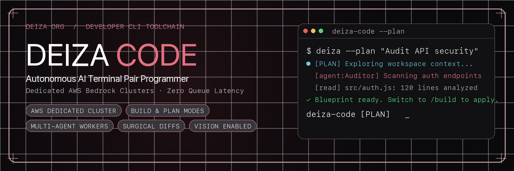
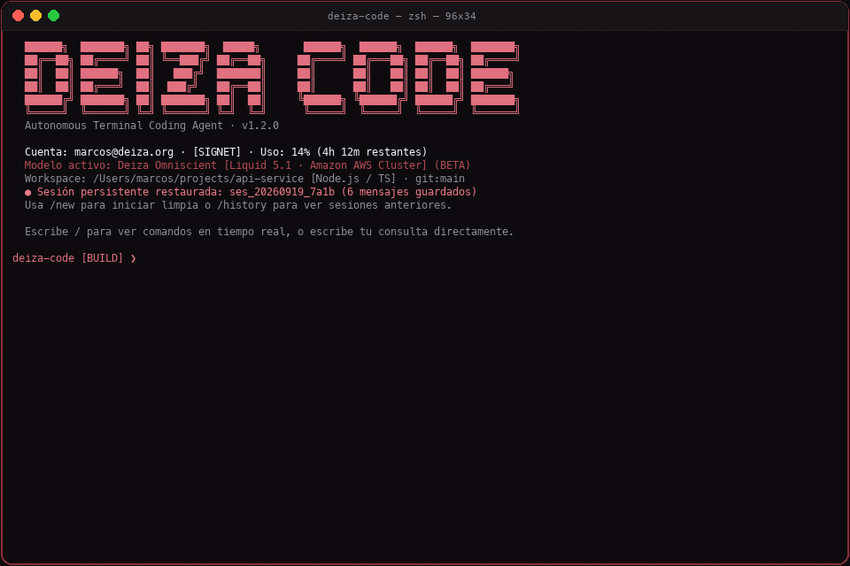

<p align="center">
  
</p>

<p align="center">
  <strong>Agente de codificación autónomo en tu terminal.</strong><br/>
  Nativo para la API de <a href="https://deiza.org">deiza.org</a> y 100% reciclable para cualquier endpoint de IA.
</p>

<p align="center">
  <a href="https://github.com/marcosdeaza/deiza-code/blob/main/LICENSE"></a>
  <a href="https://nodejs.org">=18"></a>
  <a href="https://deiza.org"></a>
  <a href="#-reciclaje-universal-usa-cualquier-ia"></a>
  <a href="https://deiza.org/download"></a>
</p>

---

## 🎬 Demostración en Vivo

Mira a **Deiza Code** analizando el repositorio, realizando preguntas interactivas, aplicando diffs quirúrgicos de código y validando los tests automáticamente:

<p align="center">
  
</p>

---

## ✨ ¿Qué es Deiza Code?

**Deiza Code** es un agente agéntico de desarrollo para terminal inspirado en la velocidad, ergonomía y precisión de *Claude Code*.

Impulsado por el modelo **Deiza Omniscient (Deiza Liquid 5.1)** en la infraestructura dedicada de Deiza: diffs quirúrgicos, ejecución autónoma y visión, sin colas de espera. Requiere una cuenta de Deiza con **plan de pago (Friend o Signet)**: la cuota se sincroniza con tu ventana de uso de 5 horas y el login se hace en un clic desde el navegador.

### Dos ediciones, un mismo código

| | Edición **open** (este repositorio) | Edición **Deiza** (instalador de deiza.org) |
| :--- | :--- | :--- |
| Login con cuenta de Deiza | Obligatorio | Obligatorio |
| Motor por defecto | Deiza Omniscient | Deiza Omniscient |
| Otros motores (`--endpoint`, `/endpoint`) | Sí: cualquier servidor OpenAI-compatible (Ollama, vLLM, LM Studio, OpenAI…) | No: funciona en exclusiva con Deiza Omniscient y tu cuota |
| Build | `node scripts/bundle.js` | `node scripts/bundle.js --flavor closed` |

> 🚀 **Cero Lock-in en la edición open:** el motor está desacoplado para que puedas **reciclar Deiza Code como CLI agéntica con cualquier otro proyecto o endpoint de IA**.

---

## 🔄 Reciclaje Universal: Usa Cualquier IA (edición open)

Deiza Code siempre arranca con tu **cuenta de Deiza** (plan Friend o Signet). En la edición open, una vez dentro puedes cambiar el motor que responde por **cualquier modelo o proveedor** que soporte la especificación estándar OpenAI `/chat/completions`:

### 1. Con Ollama en local (DeepSeek-Coder, Llama 3, Qwen)
```bash
# Inicia tu modelo en Ollama:
ollama run deepseek-coder-v2

# Lanza Deiza Code apuntando a tu instancia local:
deiza --endpoint http://localhost:11434 --model deepseek-coder-v2
```

### 2. Con OpenAI o proxies compatibles
```bash
deiza --endpoint https://api.openai.com/v1 --model gpt-4o --key sk-...
```

### 3. Con vLLM, LM Studio o LocalAI
```bash
deiza --endpoint http://localhost:8000/v1 --model mistral-7b-instruct
```

### 4. Volver al motor oficial de Deiza
```bash
deiza --endpoint deiza
# o dentro de la terminal: /endpoint deiza
```

> Variables de entorno soportadas: `DEIZA_ENDPOINT`, `DEIZA_ENDPOINT_KEY`, `DEIZA_MODEL`, `DEIZA_API_KEY`. Las variables genéricas `OPENAI_BASE_URL` / `OPENAI_API_KEY` de otras herramientas se ignoran a propósito.

---

## Características Principales

- **Tres modos de permisos: BUILD, COPILOT y PLAN:**
  - **BUILD (por defecto):** autónomo. Edita archivos, ejecuta comandos, instala dependencias y verifica sin pedir permiso. Solo se bloquean comandos catastróficos (borrar el disco, formatear, apagar la máquina).
  - **COPILOT:** supervisado. Cada edición se muestra como diff y cada comando se anuncia antes de ejecutarse; tú apruebas o rechazas cambio a cambio.
  - **PLAN:** solo lectura. Explora el código y produce un plan de implementación que luego ejecutas con `/build` o `/copilot`.
- **Persistencia de Conversaciones y Sesiones:** Guarda automáticamente el contexto completo por proyecto en `~/.deiza/sessions/`. Permite listar sesiones pasadas (`/history`), reanudarlas en cualquier momento (`/resume [id]`) o iniciar limpias (`/new`).
- **Soporte de Imágenes y Capturas en Windows CMD y Terminales:**
  - **Detección Automática de Rutas:** Si arrastras o pegas la ruta de una imagen en el CMD (ej: `"C:\path\screenshot.png"`), Deiza Code la detecta al vuelo, la convierte a base64 y la adjunta al modelo multimodal.
  - **Pegado Nativo de Capturas (`/paste`):** Si acabas de tomar una captura de pantalla con `Win + Shift + S` (Windows), `Cmd + Shift + 4` (macOS) o `PrtScn` (Linux), simplemente escribe `/paste` y se adjunta de inmediato desde el portapapeles.
- **Motor Multi-Agente:** Permite a Deiza Code delegar subtareas (investigación de contexto, auditorías de seguridad, ejecución de suites de test) a subagentes autónomos aislados (`invoke_subagent`).
- **Visión Multimodal:** Soporte nativo para inspeccionar capturas de pantalla, maquetas y assets de diseño mediante comandos `/image`, `/paste` y la herramienta `view_image`.
- **Edición Quirúrgica de Código:** Aplica reemplazos exactos mostrando **diffs visuales** en color verde y rojo directamente en la terminal antes y después de modificar archivos.
- **Motor agéntico al estilo Claude Code (v1.5):**
  - *Function calling nativo*: las herramientas se invocan como funciones reales del motor (con fallback a bloques XML en endpoints que no lo soporten).
  - *Progreso en vivo*: mientras el motor escribe un archivo ves el nombre y el tamaño crecer; cada herramienta muestra su resultado (líneas escritas, salida del comando, diff).
  - *Sin cortes*: si una respuesta o una llamada se corta por el límite de salida, Deiza Code la detecta y pide continuar por partes (`write_file` + `append_file`); si el modelo anuncia una acción sin ejecutarla, se le empuja a hacerlo.
  - *Plan visible*: `update_plan` muestra y actualiza la lista de pasos de la tarea.
  - *Esc* interrumpe una petición en curso sin salir; hasta 120 rondas de herramientas por petición.
- **Herramientas Agénticas Integradas:**
  - `read_file`, `write_file`, `append_file`, `edit_file`: lectura por rangos, creación por partes, edición quirúrgica con diff.
  - `list_dir`, `search_files` (texto/regex con glob): exploración del workspace ignorando carpetas pesadas.
  - `run_command`: comandos con captura de salida, código de salida y timeout de hasta 10 minutos.
  - `delete_path`, `move_path`: siempre dentro del workspace.
  - `fetch_url`: documentación y APIs en texto legible.
  - `update_plan`: plan de pasos visible para el usuario.
  - `invoke_subagent`: delegación de subtareas a un worker aislado.
  - `view_image`: análisis visual multimodal de maquetas e interfaces.
- **Guardas de Seguridad:** en COPILOT se aprueba cada cambio; en cualquier modo los comandos que destruirían el sistema (`rm -rf /`, `mkfs`, `format C:`, apagar la máquina) se rechazan siempre.
- **Detección Automática de Contexto:** Al arrancar en cualquier proyecto, detecta el branch de Git, archivos modificados, estructura de directorios y directivas (`.deizarules` o `CLAUDE.md`).
- **Autenticación en 1 Clic:** levanta un callback loopback local en `127.0.0.1:54321` (o un puerto libre) y abre el navegador para vincular tu cuenta al instante. La sesión se revalida en cada arranque: sin cuenta o con plan Free, Deiza Code no arranca.
- **Estética Granate Profesional (`#8C2F39`):** Interfaz sobria, minimalista, con tipografía limpia y sin elementos innecesarios.

---

## 📦 Instalación Rápida

### En macOS y Linux (Bash)
```bash
curl -fsSL https://deiza.org/install.sh | bash
```

### En Windows (PowerShell / CMD)
```powershell
irm https://deiza.org/install.ps1 | iex
```

> Los instaladores de deiza.org distribuyen la **edición Deiza** (solo Deiza Omniscient). Para la edición open, clona este repositorio o instala por npm.

### 🧠 Neural / AI Agent (Instalación Desatendida)
Pega este prompt directamente en tu agente de IA (Claude Code, Antigravity, Cursor, etc.):
```text
Instala Deiza Code en mi sistema de forma automática ejecutando el script oficial según mi sistema operativo: si es macOS o Linux ejecuta en bash 'curl -fsSL https://deiza.org/install.sh | bash', o si es Windows ejecuta en PowerShell 'irm https://deiza.org/install.ps1 | iex'. Una vez instalado, ejecuta 'deiza --version' para verificar y abre la autenticación con 'deiza --login'.
```

### Mediante npm / npx
```bash
# Ejecutar directamente sin instalar
npx deiza-code

# O instalar globalmente en tu sistema
npm install -g deiza-code
```

---

## 🕹️ Comandos en la Terminal (REPL)

> 💡 **Paleta Interactiva en Tiempo Real:** Al teclear `/` en la terminal, se despliega instantáneamente la lista de comandos disponibles con búsqueda en vivo. Presiona `Tab` para autocompletar cualquier comando.

| Comando | Descripción |
| :--- | :--- |
| `/` | Despliega la paleta interactiva de comandos en vivo |
| `/build [query]` | Modo BUILD (por defecto): autónomo, sin pedir permisos |
| `/copilot [query]` | Modo COPILOT: revisa y aprueba cada cambio y comando |
| `/plan [query]` | Modo PLAN: análisis y plan de implementación sin tocar archivos |
| `/mode [build\|copilot\|plan]` | Ver o cambiar el modo de permisos activo |
| `/history` | Ver historial de conversaciones y sesiones guardadas en este proyecto |
| `/resume [id]` | Continuar una conversación guardada restaurando todo su contexto previo |
| `/new` | Iniciar una nueva conversación limpia en este workspace |
| `/paste` | Pegar captura del portapapeles del SO (Win+Shift+S, PrtScn o Cmd+Shift+4) |
| `/agent <rol> <tarea>` | Lanza un subagente worker aislado para auditar o investigar código |
| `/image <ruta> [inst]` | Inspecciona una imagen, captura o mockup con visión multimodal |
| `/whoami` | Muestra el perfil de usuario, plan (`Friend` / `Signet`), cuota y estado de la ventana |
| `/update` | Comprueba y actualiza automáticamente Deiza Code a la última versión disponible |
| `/model [id]` | Consulta o cambia el modelo en caliente |
| `/usage` | Consulta el consumo de tokens y la cuenta atrás de la ventana de 5 horas |
| `/config` | Consulta o ajusta opciones locales (`~/.deiza/config.json`) |
| `/endpoint [url\|deiza]` | Usa otro motor OpenAI-compatible (Ollama, OpenAI, vLLM) o vuelve a Deiza *(solo edición open)* |
| `/init` | Crea un archivo de directivas `.deizarules` en la raíz de tu proyecto |
| `/clear` | Limpia el historial de la conversación actual |
| `/login` | Inicia sesión con selector interactivo (Navegador Web 1-Clic o API Key directa) |
| `/logout` | Cierra la sesión en el equipo actual y elimina credenciales locales |
| `/help` | Muestra la ayuda detallada con ejemplos de uso |
| `/exit` | Salir de Deiza Code |

---

## 🔐 Autenticación Flexible (Navegador o API Key)

Deiza Code ofrece dos métodos de conexión integrados para adaptarse a cualquier flujo:
1. **Navegador Web (Recomendado · 1 Clic):** Abre automáticamente tu navegador para autorizar la terminal de forma instantánea mediante loopback local en `127.0.0.1:54321`.
2. **API Key Directa (`dz_...`):** Ideal para entornos remotos por SSH, contenedores Docker o servidores headless donde no hay navegador disponible. La clave se valida contra la API de Deiza verificando el plan activo (`Friend` o `Signet`).

---

## 🛠️ Opciones de CLI

```text
Uso:
  deiza [opciones] [instrucción]
  deiza-code [opciones] [instrucción]

Modos de permisos:
  --build               Autónomo (por defecto): edita, ejecuta y verifica sin pedir permiso
  --copilot             Supervisado: cada cambio y comando se muestra y se aprueba
  --plan                Solo lectura: analiza y propone un plan sin tocar archivos

Opciones:
  -v, --version         Muestra la versión instalada
  -h, --help            Muestra este mensaje de ayuda
  -p, --prompt <texto>  Ejecuta una instrucción directa en modo no interactivo
  --login               Vuelve a iniciar sesión con tu cuenta de Deiza
  --logout              Cierra la sesión guardada en esta máquina
  --endpoint <url>      Motor OpenAI-compatible alternativo (Ollama, vLLM, OpenAI...)  [edición open]
  --model <id>          Modelo del endpoint alternativo                                [edición open]
  --key <apiKey>        Clave del endpoint alternativo (si la requiere)                [edición open]
```

---

## 📂 Estructura del Proyecto

```text
deiza-code/
├── bin/
│   └── deiza.js          # Punto de entrada ejecutable CLI
├── src/
│   ├── index.js          # REPL interactivo y comandos slash
│   ├── agent.js          # Motor agéntico multi-turno y cliente SSE
│   ├── session.js        # Persistencia de conversaciones por workspace
│   ├── clipboard.js      # Extracción nativa de capturas y detección en CMD
│   ├── tools.js          # Implementación de herramientas y diffs
│   ├── context.js        # Detector de Git y contexto de proyecto
│   ├── auth.js           # Servidor loopback OAuth y gestión de API key
│   ├── ui.js             # Estética granate ANSI, banners y formateadores
│   ├── config.js         # Persistencia en ~/.deiza/config.json
│   └── prompt.js         # System prompt de grado Claude Code
├── assets/
│   ├── banner.png        # Banner oficial de Deiza Code
│   └── demo.gif          # Grabación animada de la terminal en acción
├── examples/
│   ├── custom-endpoint.sh # Ejemplos de integración con Ollama y OpenAI
│   └── deizarules.example # Plantilla de directivas de desarrollo
├── scripts/
│   └── bundle.js         # Empaqueta todo en un solo archivo (--flavor open|closed)
├── package.json
└── README.md
```

---

## 📄 Licencia

Distribuido bajo la Licencia MIT. Consulta [LICENSE](LICENSE) para más detalles.
Desarrollado con ❤️ para la comunidad de desarrolladores de [Deiza](https://deiza.org).
